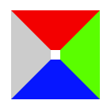
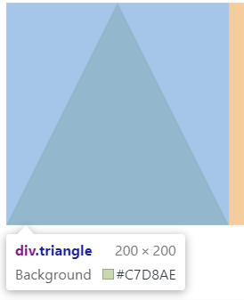

本篇文章主要介绍常用绘制三角形的技术和我在应用中的体会

  [[toc]]

# 常用技术
## border绘制
一般应该都会先想到用border绘制

  原理：一个元素的边框分成四份，上右下左，以对角线为界。
  比如对于一个div,如下样式
  ```
  width: 10px;
  height: 10px;
  border-style: solid;
  border-width: 40px 40px 40px 40px;
  border-color: #ff0000 #00ff00 #0000ff #cccccc;
  ```
  结果会是这样
  <div align=center>
      
  </div>
下面是三角形的代码示例，不规则的改变border的宽度就好
<iframe src="https://codesandbox.io/embed/objective-wind-02ic9?fontsize=14" title="objective-wind-02ic9" allow="geolocation; microphone; camera; midi; vr; accelerometer; gyroscope; payment; ambient-light-sensor; encrypted-media; usb" style="width:100%; height:500px; border:0; border-radius: 4px; overflow:hidden;" sandbox="allow-modals allow-forms allow-popups allow-scripts allow-same-origin"></iframe>

## svg绘制
使用svg绘制的话，其实更简单了
```
    <svg width="100" height="100">
      <polygon points="0,0 100,0 50,100" />
    </svg>
```
<iframe src="https://codesandbox.io/embed/winter-hooks-ejotz?fontsize=14" title="winter-hooks-ejotz" allow="geolocation; microphone; camera; midi; vr; accelerometer; gyroscope; payment; ambient-light-sensor; encrypted-media; usb" style="width:100%; height:500px; border:0; border-radius: 4px; overflow:hidden;" sandbox="allow-modals allow-forms allow-popups allow-scripts allow-same-origin"></iframe>

## transform
使用transform其实也很简单，只要大家记得平行四边形是两个三角形就可以了。

原理就是使用两个元素，子元素作为平行四边形旋转，父元素设置一个框，overflow截断。可以调整transform-origin的值，来帮助设定三角形的相对位置。

通过skew来确定不同形状的三角形，个人目前是设置一个和需要的角度相适应的tan宽、高，再旋转和skew。但是角度和我设想的略有偏差，比如下面代码不是15deg而是16.5deg的skew

具体实现见代码：

<iframe src="https://codesandbox.io/embed/transform-triangle-vv9cd?fontsize=14" title="transform-triangle" allow="geolocation; microphone; camera; midi; vr; accelerometer; gyroscope; payment; ambient-light-sensor; encrypted-media; usb" style="width:100%; height:500px; border:0; border-radius: 4px; overflow:hidden;" sandbox="allow-modals allow-forms allow-popups allow-scripts allow-same-origin"></iframe>

## clip-path

还有一种就是使用clip-path，其应用也很广泛。

<iframe src="https://codesandbox.io/embed/great-fermat-orbml?fontsize=14" title="great-fermat-orbml" allow="geolocation; microphone; camera; midi; vr; accelerometer; gyroscope; payment; ambient-light-sensor; encrypted-media; usb" style="width:100%; height:500px; border:0; border-radius: 4px; overflow:hidden;" sandbox="allow-modals allow-forms allow-popups allow-scripts allow-same-origin"></iframe>

<div class="zhuzhu-hr"></div>

# 应用

最近碰到两个需求，尝试了不同方法实现。

## hover一个三角形
如果大家打开控制台，会发现，使用border、svg、clip-path创建的三角形还是表现为一个"矩形"
<div align=center>
  
</div>
只有使用transfrom方法的才会是一个三角形，方便实现hover一个三角形元素时的效果。

## 带透明度的tooltip、对话框啥的
这种就比较适合使用border了，以免发生重叠。

# 其他一些有的没的
在使用上述几种方法绘制三角形时，有时候要选择使用嵌套元素或者伪类元素，目前觉得虽然代码不一样，但是没有明显的差异。

至于一些不同形状的三角形，比如描边三角形，可以使用两个三角形来模拟或者如果有的实现方式下直接描边；空心三角形使用border比较好。

一个利用padding,transform,切割图片为三角形的例子。也可以clip-path图片等
https://codepen.io/web-tiki/pen/ntmDK

